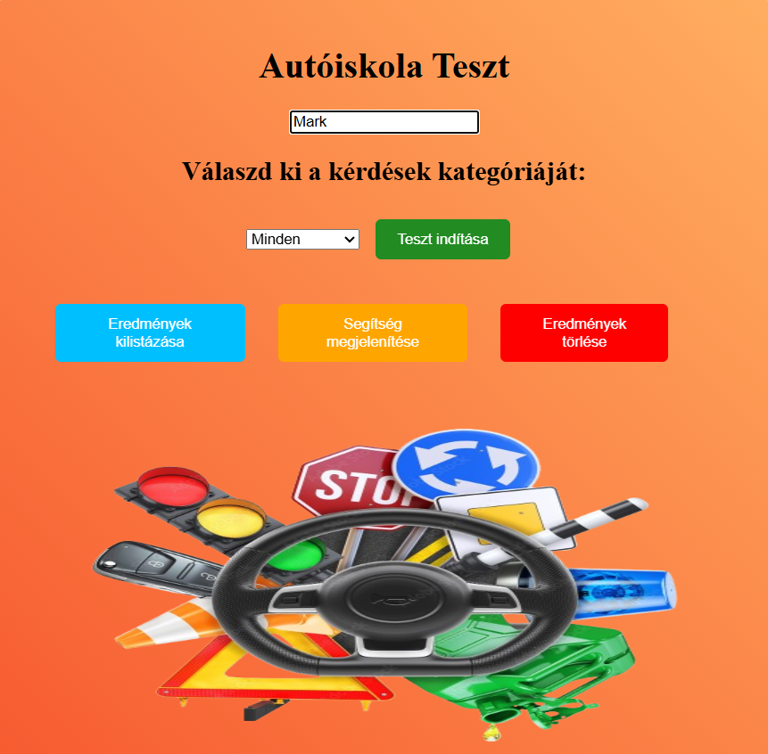
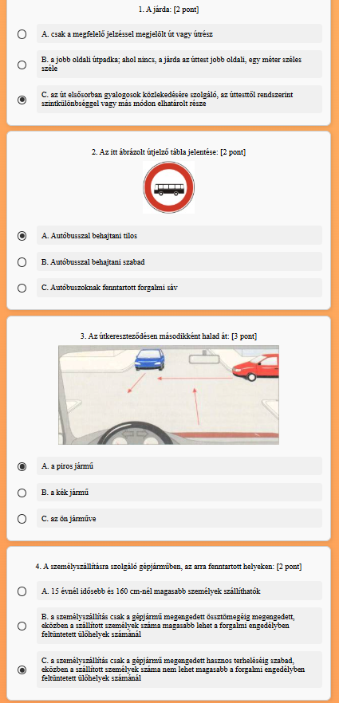
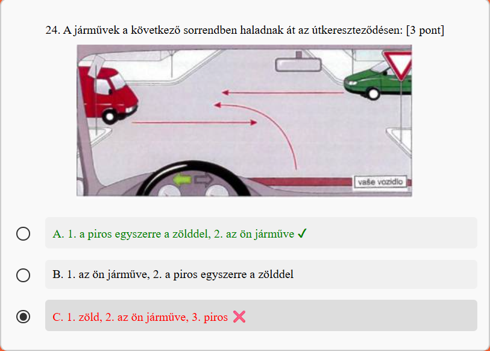
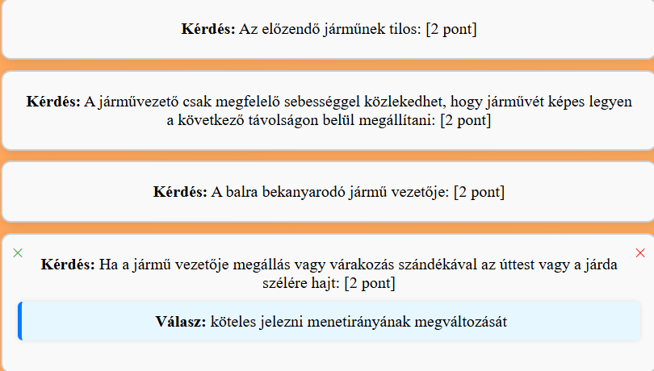

This project was created for learning and practicing core web development concepts and basic admin-style data management.

&nbsp;&nbsp;&nbsp;&nbsp;&nbsp;&nbsp;&nbsp;&nbsp;&nbsp;&nbsp;&nbsp;<b>Main page</b>

  

### Sharp test

  

### Good and bad answers

  

### Hint answers

  

